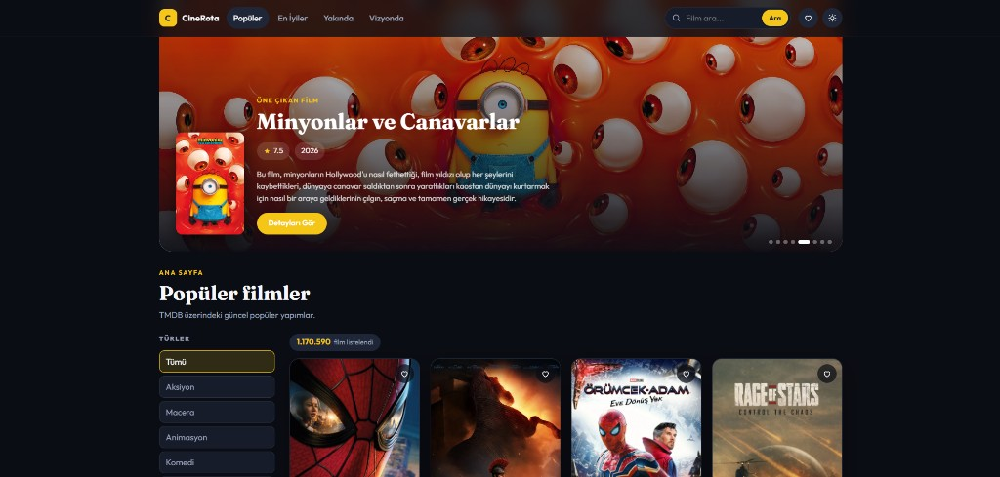

# CineRota

Vue 3 + TMDB API ile geliştirilmiş modern film keşif uygulaması.

🌐 **Canlı site:** https://aksoyece.github.io/vue-tmdb-film-listesi/



---

## Özellikler

- 🎬 Popüler, En İyiler, Yakında ve Vizyonda kategorileri
- 🔍 Film arama
- 📄 Film detay sayfası (puan, süre, özet, benzer filmler)
- ❤️ Favorilere ekle / çıkar (localStorage ile kalıcı)
- 🎭 Çoklu tür filtresi
- 🌗 Karanlık / Aydınlık tema
- 📱 Mobil, tablet ve masaüstü uyumlu tasarım
- ⚡ Sayfalama

## Teknolojiler

| Teknoloji | Kullanım amacı |
|-----------|----------------|
| Vue 3 (Composition API) | UI framework |
| Vite | Build tool |
| Vue Router | Sayfa yönlendirme |
| Pinia | State management |
| Axios | HTTP istekleri |
| TMDB API | Film verisi |

## Kurulum

```bash
# Bağımlılıkları yükle
npm install

# Ortam değişkenlerini ayarla
cp .env.example .env
```

`.env` dosyasına [TMDB API anahtarını](https://www.themoviedb.org/settings/api) ekle:

```
VITE_TMDB_API_KEY=senin_api_anahtarin
```

```bash
# Geliştirme sunucusunu başlat
npm run dev
```

## Klasör yapısı

```
src/
├── components/
│   ├── layout/     AppHeader, AppFooter
│   ├── movie/      MovieCard, MovieGrid, HeroSection
│   └── ui/         GenreFilter, PaginationBar, Loader, AppIcon...
├── views/          HomeView, CategoryView, SearchView, MovieDetailView, FavoritesView
├── router/         Vue Router tanımları
├── stores/         Pinia store'ları (movies, favorites, genres, theme)
├── services/       TMDB API istekleri
└── utils/          Tarih, puan ve görsel yardımcı fonksiyonlar
```
